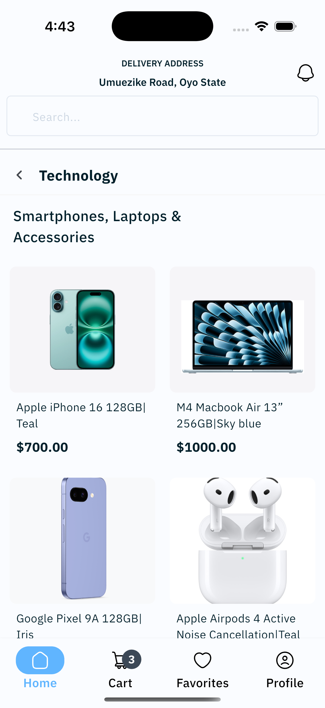
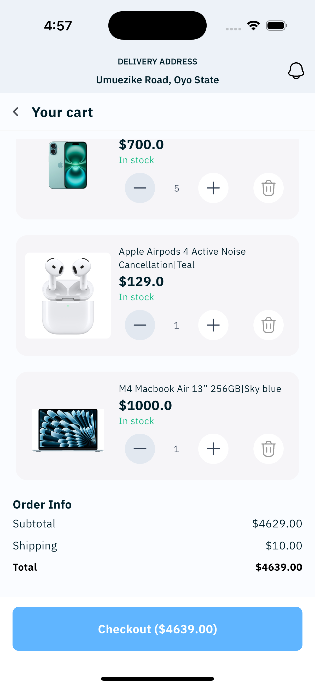

# 🛍️ Flutter App

A simple and responsive shopping cart app built with **Flutter**, featuring offline persistence using **Hive**, state management with **Provider**, and a clean user interface.

---

## 🧰 Tech Stack

| Category        | Technology                                                        |
|----------------|-------------------------------------------------------------------|
| Framework       | [Flutter](https://flutter.dev)                                    |
| Language        | Dart                                                              |
| Local Database  | [Hive](https://pub.dev/packages/hive)                             |
| State Management| [RiverPod](https://pub.dev/packages/riverpod)                       |
| Image Caching   | [CachedNetworkImage](https://pub.dev/packages/cached_network_image) |
| UI Components   | Material Design                                                   |

---

## 🚀 Getting Started

### ✅ Prerequisites

- Flutter SDK installed ([Installation Guide](https://docs.flutter.dev/get-started/install))
- An IDE (e.g., VS Code or Android Studio)
- A connected device or emulator


## 📸 Screenshots

| 🏠 Home Page | 📦 Product Details | 🛍️ Cart Page |
|-------------|--------------------|--------------|
|  |  |  |


### 📦 Clone the Repository

```bash
git clone https://github.com/Ensonberg/alphatwelve_test.git
cd aphatwelve

### 📦 Clone the Repository
flutter pub get
flutter packages pub run build_runner build
flutter run 

